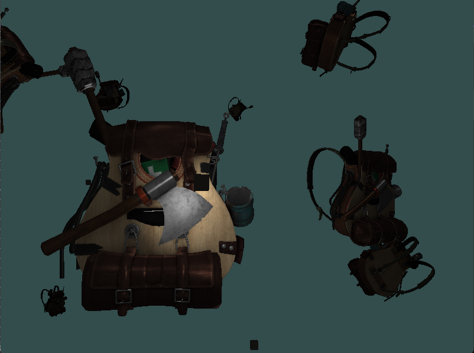
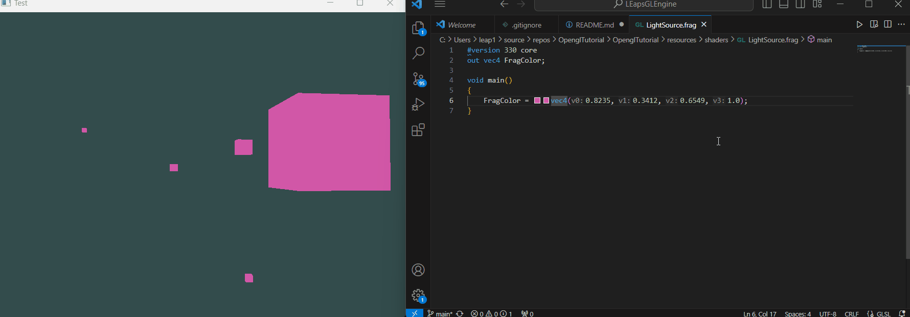

# LEaps ECS Pattern


## Overview

### What is ECS?

Entity-Component-System (ECS) is a design pattern widely used in software development, especially in game development. It divides the application into three key components:

1. **Entities:** Unique identifiers representing basic objects in the system.

2. **Components:** Data containers holding specific attributes or behaviors, describing properties of an entity.

3. **System:** Manages logic and behavior of entities based on their components, processing entities with specific combinations.

## Main Feature (December 2023)


### Mesh object Loading and Rendering

- **ECS Architecture Implementation**
- **Lighting Solutions**
- **3D File(.obj) Loading and Rendering**

<br>


### Dynamic Shader Compilation

- **Shader Hot Compiling for Editor**
- **Dynamic shader program optimization**


## LEaps ECS Pattern

LEaps (Lightweight ECS for Advanced Performance and Scalability) is an ECS pattern designed for efficiency and scalability, particularly suitable for real-time systems and game engines. 

### Key Features

1. **Efficiency:** High performance achieved by minimizing memory overhead and maximizing cache coherence.

2. **Scalability:** Designed to scale well with a large number of entities and components, allowing efficient queries.

3. **Flexibility:** Easily add, remove, and modify components without significant impact on performance.

## Sparse Table Architecture

### What is Sparse Table Architecture?

In LEaps, the ECS pattern is implemented using a sparse table architecture to optimize memory usage and improve cache locality.

### How Sparse Table Architecture Works

1. **Sparse Data Storage:** Tables only store components for entities possessing those specific components, reducing memory consumption.

2. **Cache Coherence:** Enhances cache coherence by storing related data close in memory, improving performance.

3. **Dynamic Composition:** Allows dynamic composition of entities and components without affecting memory layout.

## Getting Started

To integrate LEaps ECS into your project:

1. Clone the LEaps ECS repository.

2. Include necessary headers and source files in your project.

3. Define entities, components, and systems following the ECS pattern.

4. Leverage the sparse table architecture for efficient memory usage and improved performance.

### Example Usage

```cpp
#include "pch.h"
#include "core/World.h"
#include "core/Container.h"
#include "core/entity.h"
#include "core/Type.h"
#include "core/System.h"

struct Position {
    int x, y;
};

struct PositionDelta {
    using instance_type = int;
};

TEST(SimpleExample, SimpleTutorial) {
    // Create a world instance with Position components
    auto& world = LEapsGL::Universe::GetRelativeWorld<Position>();

    // Create entities and assign Position components
    for (int i = 0; i < 10; i++) {
        auto entt = world.Create();
        world.emplace<Position>(entt, Position{ i, i + 1 });
        if (i % 2 == 0) 
            world.emplace<PositionDelta>(entt, i);
    }

    // Access entities with both Position and PositionDelta components
    auto view = world.view<Position, PositionDelta>();
    view.each([](auto& position, auto& delta) {
        cout << "Next position: " << (position.x + delta) << " " << (position.y + delta) << "\n";
    });

    // Output
    /*
        Next position: 0 1
        Next position: 4 5
        Next position: 8 9
        Next position: 12 13
        Next position: 16 17
    */
}
```

Feel free to explore and modify this example to suit your application's needs. Refer to the documentation for more advanced usage and features of LEaps ECS Pattern.

## Conclusion

LEaps ECS Pattern provides a lightweight, efficient, and scalable solution for systems requiring high performance. By embracing the sparse table architecture, developers can create fast, flexible, and maintainable applications.